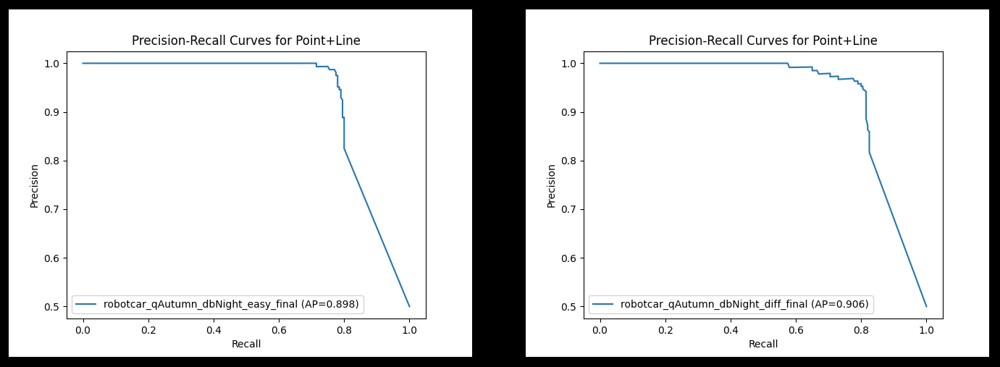
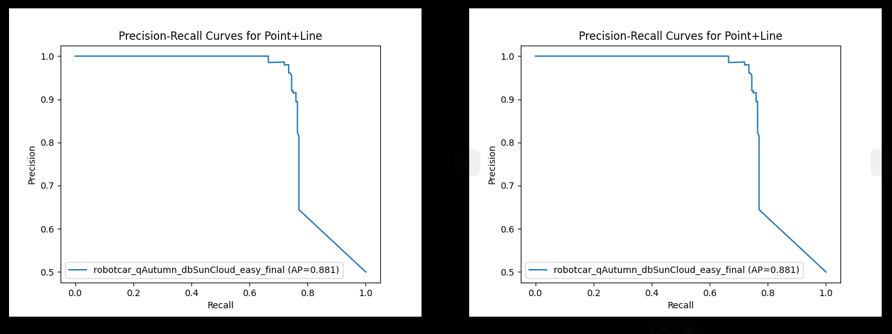

# PL-Loop: Robust loop detection method with both point and line features

- EE5346 project: loop detection
- The following three datasets are used for evaluation
    - **qAutumn_dbSuncloud** (selected from the Oxford RobotCar): Dynamic objects, seasonal change, small viewpoint change
    - **qAutumn_dbNight** (selected from the Oxford RobotCar): Dynamic objects, large light change, small viewpoint change
    - **Kudamm** (selected from the Kudamm dataset): Dynamic objects, large viewpoint change
    - `.txt` files are in folder`datasets`
```bash
# For example, in the first line of "robotcar_qAutumn_dbNight_diff_final.txt"
Autumn_mini_query/1418133788799845.jpg, Night_mini_ref/1418756794975225.jpg, 1
# "query image file name", "reference image file name", "label" (1 for true loop verification, 0 for false one)
```


## Prerequisites
Install SOLD²
```bash
cd SOLD2
pip install -r requirements.txt
pip install -e.
```

The pretrained model that we used is the same as the original version of SOLD² trained on the Wireframe dataset. It can be downloaded [here](https://www.polybox.ethz.ch/index.php/s/blOrW89gqSLoHOk). This download link is provide by [SOLD²](https://github.com/cvg/SOLD2). Put this pretrained model in folder `SOLD2/pretrained_models`.

Install DeepLSD
```bash
cd DeepLSD
bash quickstart_install.sh
```

Install SuperGlue
```bash
cd SuperGlue
pip install -e.
```

## Dataset test
Use the following command lines to get the Precision-Recall curves for the prepared dataset

ORB baseline:
```bash
python baseline_ORB.py
```

Loop detection with only line features (DeepLSD+SOLD²):
```bash
python line_only_val.py
```

Loop detection with only point features (SuperPoint+SuperGlue):
```bash
python point_only_val.py
```

Loop detection with both point and line features:
```bash
python pl_val.py
```




## Final test
The final test datasets are selected from Oxford RobotCar, including two mini datasets:

- **qAutumn_dbNight_val** (1600 pairs): Dynamic objects, large seasonal change and small viewpoint change (distance of two places is smaller than 5 meter)
```bash
python final_val_dbNight.py
```

- **qAutumn_dbSuncloud_val** (1600 pairs): Dynamic objects, seasonal change and large viewpoint change (distance of two places is larger than 15 meter)
```bash
python final_val_dbSunCloud.py
```

The results are named as `robotcar_qAutumn_dbNight_val_result.txt`, `robotcar_qAutumn_dbNight_val_result.txt` and look like (1 for true and 0 for false):
```
1
0
1
```

The results are in `results` folder.

## Acknowledgements
- [SOLD²](https://github.com/cvg/SOLD²)
- [DeepLSD](https://github.com/cvg/DeepLSD)
- [SuperPoint](https://github.com/rpautrat/SuperPoint)
- [SuperGlue](https://github.com/magicleap/SuperGluePretrainedNetwork)
- [Oxford RobotCar Dataset](https://robotcar-dataset.robots.ox.ac.uk/)
- [Kudamm Dataset from Mapillary](https://www.mapillary.com/dataset/places)

